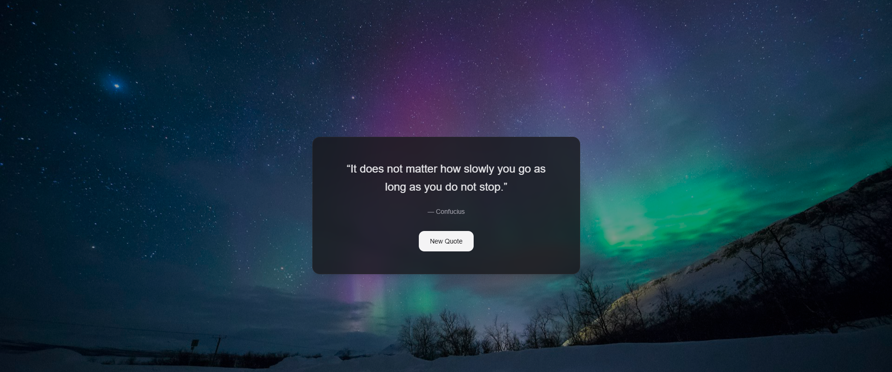

# ✨ Quote Generator

A simple, elegant web app that delivers random motivational quotes with every click — complete with a fresh background image to match the mood.

Built with **Next.js 16**, **React 19**, **TypeScript 5**, and **Tailwind CSS 4**.



## 🚀 Features

- Fetches real quotes from the [Quotable API](https://github.com/lukePeavey/quotable) — with a local fallback when offline
- Cycles through 6 full-screen background images with a smooth crossfade transition
- Dark overlay for readability, glass-morphism card design
- Fully responsive

## 🛠️ Getting started

```bash
npm run dev
```

Open [http://localhost:3000](http://localhost:3000) and hit **New Quote** to see it in action.

## 📦 Commands

| Command | Description |
|---------|-------------|
| `npm run dev` | Start development server |
| `npm run build` | Production build |
| `npm run lint` | Run ESLint |

## 📸 Credits

- Background images from [Unsplash](https://unsplash.com)
- Powered by [Next.js](https://nextjs.org)
